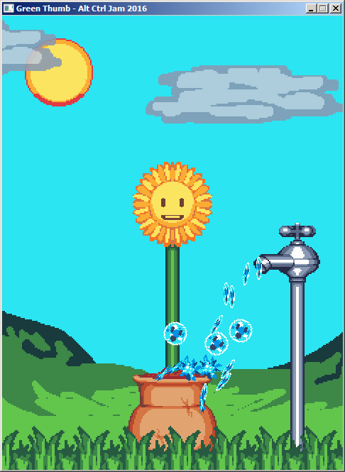
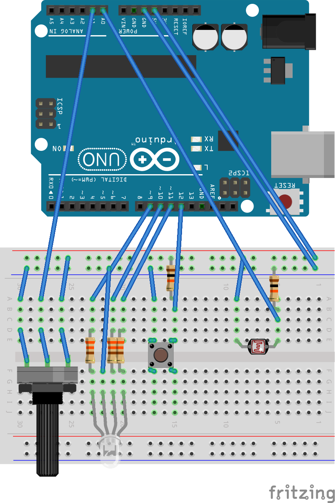
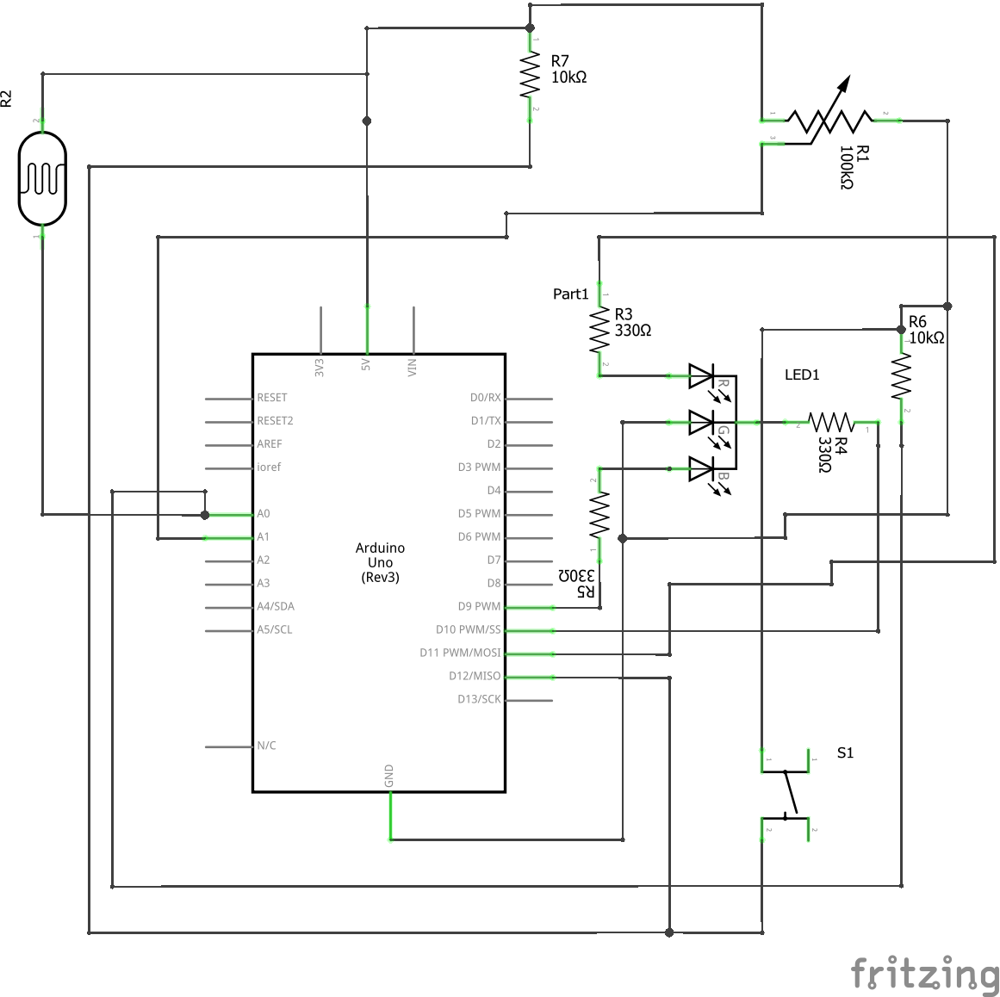

# Alt-Ctrl-Game-Jam-2016
My (late) entry for Alt Ctrl Jam. More info here: https://itch.io/jam/altctrl2016

[Link to Youtube video](https://youtu.be/Zrh4ZZVeD1w)

## Introduction
This is a project that was developed in a week for Alt Ctrl Jam 2016. The rules of the game jam is that you have to make your own unique  controller. At the time I didn't know we didn't necessarily have to make a game so I made both. The game jam allowed for 10 days but I learned of the jam late and so I had less time to create my controller and my game. The controller was created using an Arduino UNO board and the game was programmed in C++ with SFML.

## How to build
You guys know how much I love single file projects because of how easy they are to build. I also provided a Makefile but you are going to have to edit it to make sure it points to the right path where you installed SFML.

To build the example program on Windows with Visual Studio open a `Developer Command Prompt` and enter this:

Change your directory to the source directory
>cd C:/path/to/source

Compile and link the source code
>cl /I C:/path/to/SFML/include C:/path/to/SFML/lib/sfml-system.lib C:/path/to/SFML/lib/sfml-window.lib C:/path/to/SFML/lib/sfml-graphics.lib GreenThumb.cpp

The code should compile and produce GreenThumb.exe.

If you are using GCC or MinGW open a `Command Prompt` or `Terminal` and enter this:

Change your directory to the source directory
>cd C:/path/to/source

Compile and link the source code
>g++ GreenThumb.cpp -I C:/path/to/SFML/include -L C:/path/to/SFML/lib -lsfml-graphics -lsfml-window -lsfml-system -s -O2 -o GreenThumb.exe

__Note!__ I don't know if this needs saying but use your own directories. C:/path/to/SFML is not a real directory, just an example. Just in case..

## How to use
To be able to play this little tech demo you are going to have to build the controller I designed using an Arduino UNO. Here are some images that may help you build it.

